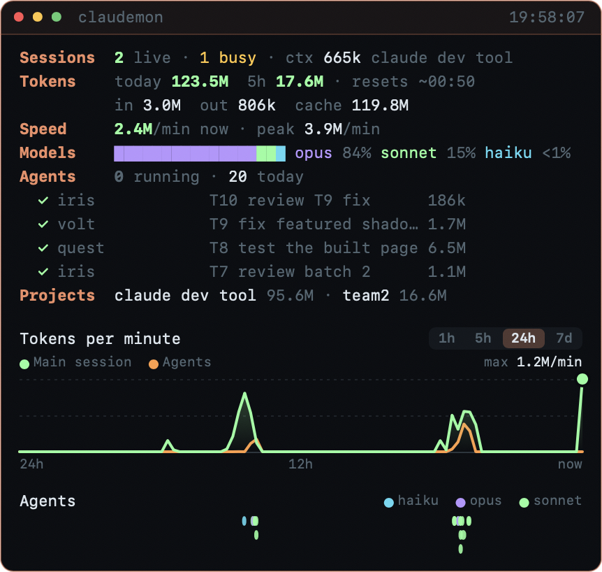

# Claude Code Dev Team

> **Community project, not affiliated with or endorsed by Anthropic.** "Claude" and "Claude Code" are trademarks of Anthropic.

**Turn Claude Code into a small software team.** One script sets up 9 specialist agents in your project: a discovery interviewer, a planner, an architect, a developer, a reviewer, a tester and more. Claude then runs them in parallel, with each on a model suited to its job.

## What it's for

Asking one Claude session to "build this app" puts everything in one conversation: requirements, design, code, tests and review. The context fills up, decisions get lost, and nothing checks the work.

This repo splits that work the way a real team would:

1. **ECHO** interviews you and writes down what you actually want, before any code exists.
2. **ATLAS** designs the architecture.
3. **LUNA** breaks the work into a task queue of small tasks.
4. Claude runs the queue **in batches, several agents at a time**: **VOLT** builds, **QUEST** tests, **SAGE** documents.
5. **IRIS** reviews the changes VOLT, DEBUG and SWIFT make, and none of them counts as done until IRIS approves.

Everything the team decides is written to a `claude/` folder in your project, so the plan, requirements and review history survive between sessions.

## Why it's efficient

Three things save time and money. Every number below is either Anthropic's published price or a setting you control; none are estimates.

**1. Cheaper models for simpler work.** Each agent has its own model. Claude API prices per million tokens, from [Anthropic's pricing page](https://platform.claude.com/docs/en/about-claude/pricing) (checked September 24, 2026):

| Model | Input | Output | Price vs Opus 5.5 | Used by (default profile) |
|-------|-------|--------|-------------------|---------------------------|
| Haiku 4.5 | $1 | $5 | **¼** | SAGE (docs) |
| Sonnet 5 | $2 | $10 | **½** | ECHO, LUNA, VOLT, IRIS, SWIFT, DEBUG, QUEST |
| Opus 5.5 | $4 | $20 | 1× | ATLAS (architecture) |
| Fable 5.1 | $10 | $50 | 2.5× | Only when a task asks for it |

So with the default profile, 7 of the 9 agents cost half as much per token as running everything on Opus 5.5, and the docs agent costs a quarter. These are per-token prices: total cost also depends on how many tokens each task uses, which depends on your project.

The agent files use Claude Code's model aliases (`haiku`, `sonnet`, `opus`); the table shows the versions current at the time of writing. If you use a Claude subscription rather than the API, you don't pay per token, and model choice affects how fast you use your plan's limits instead.

**2. Real parallel work.** ATLAS designs the code so features can be built separately: their own files, or their own marked regions of a shared file. LUNA then plans the features to run side by side. Claude keeps up to your chosen number of agents (1–20) busy, starting each task as soon as the tasks it depends on are done. Each coding agent works in its own git worktree, and git merges their work. The build is only split when each part is substantial on its own: every extra agent has to read the brief and design first, so for a small job such as a single page, one developer is faster and cheaper.

**3. Smaller, focused contexts.** Each agent works in its own context window and reports back a short summary. Your main session doesn't fill up with every file each agent read, so it stays responsive for longer.

**What we haven't measured:** we don't publish speed-up or savings percentages for whole projects, because they depend on the project, and made-up averages would be misleading. To measure your own, run [Claudemon](#watch-it-live-claudemon) alongside the team: it shows tokens by model, tokens per minute and every agent's token count as it runs.

## Quick start

```bash
git clone https://github.com/prantopi/claude-code-dev-team.git ~/claude-code-dev-team
cd your-project
~/claude-code-dev-team/setup.sh .    # 3 questions; add --auto to accept the defaults
claude --agent echo                  # ECHO interviews you about your project
```

Then open `claude` in the same folder and say **"have atlas design the architecture"**, **"have luna plan the tasks"** and **"run the next batch"**. The full guides are below.

## Installation

### Requirements

- [Claude Code](https://code.claude.com), installed and signed in
- bash: built into macOS and Linux. On Windows, use [WSL](https://learn.microsoft.com/windows/wsl/install) or Git Bash.
- git, with your name and email set (`git config --global user.name "Your Name"` and `user.email`). You can turn git off with `--no-git`.
- Optional, for [Claudemon](#watch-it-live-claudemon): macOS 11 or later and Apple's command line tools (`xcode-select --install`)

### 1. Get the scripts

Clone the repo once, anywhere. You'll reuse it for every project.

```bash
git clone https://github.com/prantopi/claude-code-dev-team.git ~/claude-code-dev-team
```

### 2. Add the team to a project

Run the setup script from inside your project folder. It works in a new, empty folder or an existing codebase.

```bash
cd path/to/your-project
~/claude-code-dev-team/setup.sh .
```

It asks three questions. Press Enter to accept each default:

1. **Model profile:** which model each agent uses (`balanced`, `economy`, `quality` or `inherit`, see [Models](#models))
2. **Parallel agents:** how many agents may run at once (default 3)
3. **Token budget:** optional; Claude pauses and asks you when the budget's alert level is reached
4. **Use git:** yes by default; see [Git workflow](#git-workflow). If the folder isn't a git repository yet, the script creates one.

To skip the questions, use flags instead, for example `setup.sh . --auto --profile economy --parallel 5`. See [Options](#options).

The script adds `.claude/agents/`, a `claude/` workspace folder and a `CLAUDE.md` to your project. It never overwrites files that already exist. If your project already has a `CLAUDE.md`, it adds one import line to the end of it.

### 3. Check it worked

Start Claude Code in the project. The first time, it asks whether you trust the folder: accept, because the team's git permissions in `.claude/settings.json` only apply after you do. Then ask:

```
> which subagents are available in this project?
```

Claude should list the nine agents: echo, luna, atlas, volt, iris, swift, sage, debug and quest.

### Updating

Pull the latest version, then regenerate the agent files in each project. Your notes and plans in `claude/` are kept.

```bash
git -C ~/claude-code-dev-team pull
cd path/to/your-project
~/claude-code-dev-team/setup.sh . --update-agents --auto
```

`--update-agents` rewrites only the 9 agent files, `claude/TEAM.md` and `claude/TEAM-CONFIG.md`. Pass `--profile` or `--parallel` at the same time to change those settings.

### Uninstalling

Delete what the script added:

```bash
rm -r .claude/agents claude
```

Then remove the `@claude/TEAM.md` line from `CLAUDE.md`. If the script created `.claude/settings.json`, it only contains the parallel-agent setting and can be deleted too.

## Usage guide

You talk to the team in plain English, in a normal Claude Code session. Claude knows the workflow because `CLAUDE.md` loads `claude/TEAM.md` at the start of every session.

### Small jobs: the fast path

For one feature, fix or page, you don't need the whole team. Just ask, for example *"add a dark mode toggle to the settings page"*. Claude skips discovery, design and planning: VOLT builds it and IRIS reviews it, and the tasks are still logged in the queue. For bigger or less clear work, Claude uses the full workflow below. You can always ask for the full workflow by name.

### Step 1: Discovery, with ECHO

```bash
claude --agent echo
```

ECHO asks about your project a question or two at a time: what it does, who it's for, must-have features, what to leave out, tech constraints and risks. It records your answers, reads back a summary for you to correct, then writes the requirements, feature list, scope and risks into `claude/echo/`.

For an existing codebase, tell ECHO what you want to change, not the whole history of the project.

### Step 2: Design, with ATLAS

Start a normal session with `claude`, then:

```
> have atlas design the architecture
```

ATLAS reads the requirements and any existing code, then writes the design into `claude/atlas/`, including where new code should go.

### Step 3: Plan, with LUNA

```
> have luna plan the tasks
```

LUNA writes `claude/luna/task-queue.md`: small tasks grouped into batches. Each task has an agent, an optional model, what it depends on, and the files it will touch. Open the file and edit anything you disagree with before running it; it's plain Markdown.

### Step 4: Run the batches

```
> run the next batch
```

Claude launches every task that's ready, up to your limit, and starts the next ones as soon as their dependencies finish. ATLAS's build contract splits the work by feature: a small scaffold task first, then one VOLT task per feature (hero, pricing, FAQ…), each owning its own files or its own marked region of a shared file. The features are built at the same time and git merges them. When the agents finish, Claude marks each task `done` or `blocked`, summarizes what happened, and **asks you before starting the next batch**. Say "run the next batch" again to continue.

Every change by VOLT, DEBUG or SWIFT goes to IRIS for review as soon as it's finished, while the rest of the batch keeps going. If IRIS says NEEDS CHANGES, a fix task goes back into the queue for the agent that made the change.

### Other things you can ask for

| You want to | Say |
|-------------|-----|
| See progress | "have luna update the status", then open `claude/luna/status.md` |
| Fix a bug | "have debug find out why the login test fails" |
| Review something right now | "have iris review the changes in src/auth/" |
| Write tests | "have quest add tests for the upload feature" |
| Update docs | "have sage update the setup guide" |
| Speed something up | "have swift profile the dashboard page" |
| Add work to the plan | "have luna add a task for dark mode" |
| Use a stronger model once | Put `opus` or `fable` in that task's Model column |

### Where to find things

`claude/INDEX.md` links to everything. The files you'll open most:

| File | What's in it |
|------|--------------|
| `claude/echo/requirements-summary.md` | What you're building |
| `claude/atlas/architecture.md` | How it's designed |
| `claude/luna/task-queue.md` | Every task and its status |
| `claude/iris/issues-found.md` | Open review findings |
| `claude/luna/usage-log.md` | Tokens used per task (and your budget, if set) |

## The team

| Agent | Role | Tools | Writes to |
|-------|------|-------|-----------|
| 📋 **echo** | Discovery: interviews you, writes requirements, scope and risks | Files only | `claude/echo/` |
| 🌙 **luna** | Planning: task queue, status, blockers | Files only | `claude/luna/` |
| 🏗️ **atlas** | Architecture and design decisions | Files only | `claude/atlas/` |
| ⚡ **volt** | Implements features | All (can't launch agents) | Source code |
| 🔍 **iris** | Reviews code changes; never edits source | Files + shell | `claude/iris/` |
| ⚙️ **swift** | Measures and improves performance | All (can't launch agents) | Source code |
| 📚 **sage** | Documentation | Files only | `claude/sage/`, docs |
| 🐛 **debug** | Finds root causes, fixes, adds regression tests | All (can't launch agents) | Source code |
| ✅ **quest** | Writes and runs tests | All (can't launch agents) | Tests |

Agents can't launch other agents. Your main Claude session coordinates everything, following `claude/TEAM.md`.

## Git workflow

The team works like a professional software team: every change is made on a branch, committed, reviewed and merged. Nothing is pushed unless you ask.

1. **A team branch.** Before the first build task, Claude creates a branch such as `team/landing-page`. All work merges into it. `main` stays untouched until you merge the team branch yourself or open a pull request.
2. **A worktree per coding agent.** VOLT, DEBUG, SWIFT and QUEST each run in their own [git worktree](https://code.claude.com/docs/en/worktrees), a separate copy of the code on its own branch. Parallel agents can't overwrite each other, and each makes one commit for its task.
3. **Conventional commit messages:** `feat(T4): add pricing toggle`, `test(T5): add signup form tests`, `merge(T4): …`, `chore(team): plan batch 2`.
4. **Merge, then review, task by task.** As soon as an agent finishes, Claude merges its branch with `--no-ff`, removes the worktree, and has IRIS review just that task's changes, like a pull request, while the other agents keep working. A task is only done when IRIS approves.
5. **You decide what ships.** When the queue is done, Claude shows you the branch's commits and offers to push it and open a pull request with `gh`. It only does so if you say yes.

Here's the history from a real run, a small fast-path job:

```
* chore(team): batch 2 approved by iris
*   merge(T5): add unittest tests for greet
|\
| * test(T5): add unittest tests for greet
|/
*   merge(T4): add greet function
|\
| * feat(T4): add greet function
|/
* chore(team): plan batch 2
* chore: set up Claude dev team        ← main
```

**Guard rails** in `.claude/settings.json`: everyday git commands (status, diff, log, add, commit, branch, switch, merge, worktree) run without prompts, and destructive ones (`push --force`, `reset --hard`, `clean`, `rebase`, `branch -D`) are blocked. A plain `git push` always asks you first.

## Watch it live: Claudemon



`claudemon/` contains a small floating dashboard for macOS. It shows each agent as it runs, with its task, tokens and run time, plus token usage, speed, models and a live chart. It reads Claude Code's local logs and sends nothing anywhere.

```bash
cd claudemon && ./build.sh && open Claudemon.app
```

It also works on its own for any Claude Code user: see [claudemon](https://github.com/prantopi/claudemon).

## Models

Each agent has a default model, set by the profile you choose during setup:

| Profile | ATLAS | IRIS | DEBUG | SAGE | LUNA | Everyone else |
|---------|-------|------|-------|------|------|---------------|
| **balanced** (default) | opus | sonnet | sonnet | haiku | sonnet | sonnet |
| **economy** | sonnet | sonnet | sonnet | haiku | haiku | sonnet |
| **quality** | opus | opus | opus | sonnet | sonnet | sonnet |
| **inherit** | your session's model, for every agent | | | | | |

You can override the default per task by filling in the **Model** column in the task queue (`haiku`, `sonnet`, `opus` or `fable`). LUNA suggests a model when it plans. Claude passes that model when it launches the agent, so the override takes effect.

To change one agent permanently, edit the `model:` line in `.claude/agents/<name>.md`.

## Parallel agents and budget

- **Parallel agents** (1–20, default 3): the most agents Claude runs at once. The limit is written into `claude/TEAM.md`. It's also set as `CLAUDE_CODE_MAX_CONCURRENT_SUBAGENTS` in `.claude/settings.json`. If you already have that file, the script only updates this one value when it's there, and otherwise tells you what to add.
- **Token budget** (optional): after each batch, Claude logs the tokens each agent reported in `claude/luna/usage-log.md`. When the total reaches your alert level, it stops and asks you before continuing. This is a soft limit that Claude follows, not a hard cap. Your actual limits are set by your Claude plan.

## What the script creates

```
your-project/
├── CLAUDE.md                 # imports claude/TEAM.md (appended if you already have one)
├── .gitignore                # ignores .claude/worktrees/ and .claude/settings.local.json
├── .claude/
│   ├── agents/*.md           # the 9 subagents
│   └── settings.json         # parallel-agent cap, worktree base, git permissions (only if missing)
└── claude/
    ├── INDEX.md              # dashboard, links to everything
    ├── TEAM.md               # how Claude runs the team
    ├── TEAM-CONFIG.md        # your settings and how to change them
    ├── PROJECT_SPEC.md, CHANGELOG.md
    └── echo/ luna/ atlas/ volt/ iris/ swift/ sage/ debug/ quest/   # 50 working files
```

## Options

```
./setup.sh [project-dir] [options]

  --auto             use defaults, ask nothing
  --profile NAME     balanced (default), economy, quality, inherit
  --parallel N       max agents running at once, 1-20 (default 3)
  --budget N         soft token budget (default: none)
  --alert PCT        alert at this % of the budget (default 80)
  --no-git           don't use git (agents work directly in your files)
  --update-agents    regenerate the agents, TEAM.md and TEAM-CONFIG.md with new settings
```

The script never overwrites existing files, so re-running it is safe. `--update-agents` is the one exception: it rewrites only the 9 agent files, `TEAM.md` and `TEAM-CONFIG.md`. Your notes and plans in `claude/` are always kept.

## Changes from v4

- **Real agents.** v4 only created empty folders. v5 creates Claude Code subagents that Claude can launch in parallel.
- **Nothing is missing.** v4 created 8 files, left every agent folder empty and had 11 broken links. v5 brings back all the v1/v2 templates, including ECHO's questions, the review checklist and the test templates. There are no broken links.
- **Settings take effect.** Model choices, the parallel limit and the budget are read by Claude instead of only being documented.
- **The made-up tiers are gone.** "Claude Plus", "1000 agents" and fixed daily token limits aren't real plan features.
- **Bugs fixed.** Literal `$(date)` text in files, unvalidated input, Fable missing from the model choices, and logs overwritten on re-run.

## License

[MIT](./LICENSE)
